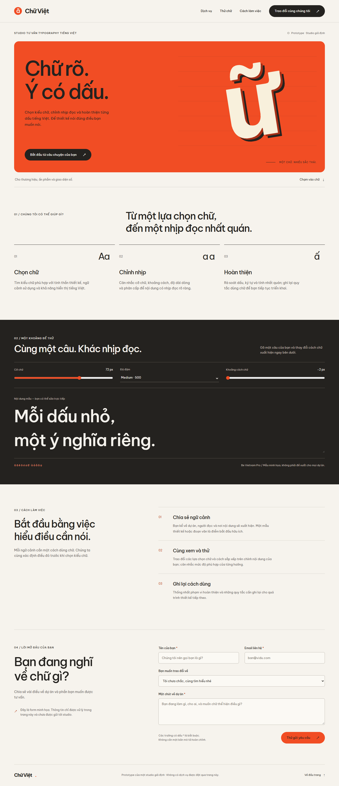
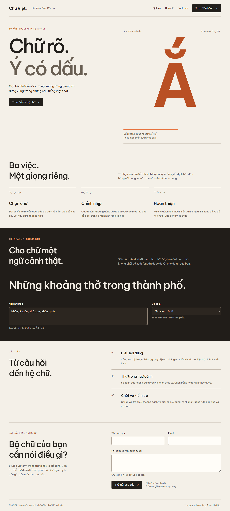
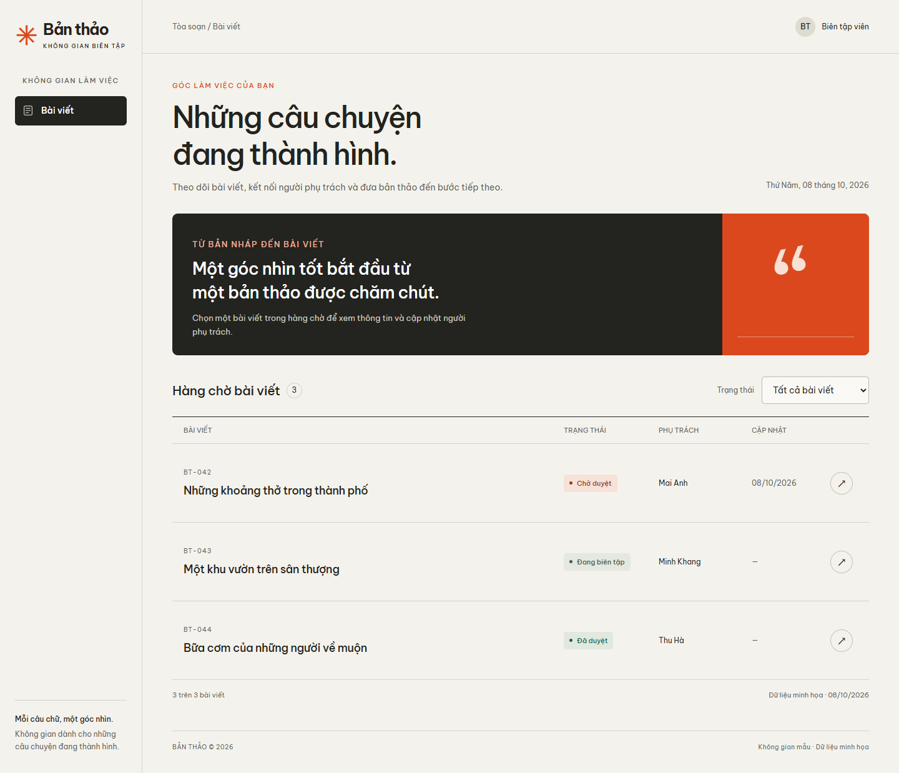
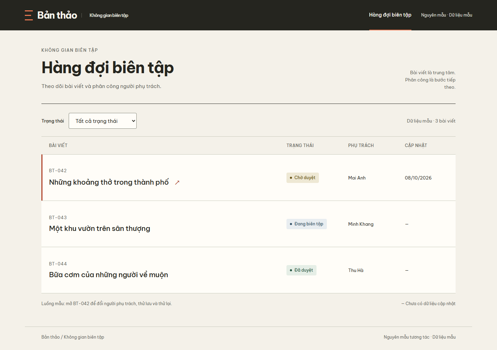

# Pilot 08/10/2026: đầu ra, hành vi và giới hạn

**Trạng thái: đã render và kiểm tra browser; chủ skill chưa duyệt gu.** Đây là pilot chẩn đoán, không phải benchmark chứng minh skill luôn tạo UI đẹp hơn. Không dùng case AI interview.

## Phương pháp và provenance

- Hai brief: một trang công khai của studio typography, một workspace biên tập. Hai loại bề mặt khác nhau nhưng cùng gần lĩnh vực nội dung/chữ; chưa đại diện cho thương mại, y tế, finance hay vận hành mật độ cao.
- Cùng nội dung bắt buộc, bộ bảy ảnh có thể xem, ba font local, viewport 1440 × 900 và 390 × 900. Các agent tự chọn ảnh nào thật sự mở; report ghi rõ tập đã xem. Không sử dụng pixel/logo từ ảnh mẫu trong UI mới.
- Control và skill-app được tạo ở các context subagent mới với cấu hình kế thừa từ phiên root, không override model. Tool không cung cấp model ID/seed cụ thể cho các lượt này, nên không tự ghi một model ID phỏng đoán. Không đặt cùng giới hạn thời gian/token; prompt giao việc khác cách diễn đạt, giữ cùng dữ kiện. Đây chưa phải thí nghiệm được kiểm soát hoàn toàn.
- Control không đọc custom skill hoặc hướng dẫn art direction khác. Skill-app đọc skill và các reference liên quan; có ghi nhận mở hai JPG gốc. Điều này xác nhận tuân thủ **gọi tường minh**, không kiểm tra tự kích hoạt.
- Lượt subagent skill-public bị chặn bởi quota trước khi tạo file. Root hoàn tất mẫu công khai trực tiếp, sau khi đã đọc report của control. Vì vậy **cặp public không độc lập** và không dùng để suy ra hiệu quả nhân quả của skill.
- Bản skill được thử có SHA-256 `1678920194cb5b93047da40ed121f56fe5efd49f9405e0b08a7b53663b9a4638`; hash text chuẩn hóa UTF-8 không BOM/LF để nhất quán qua checkout Windows; repo trước sửa là commit `2364c9097497b252e75e076217b0d3f7b7ca72a5`. [Manifest](manifest.json) ghi hash source đầu ra cuối. Cập nhật docs sau lượt này không được coi là đã có một lượt tạo lại độc lập.
- Root render tất cả bằng cùng script/browser. Control được giữ nguyên source. Root sửa candidate public một vòng sau render vì dấu sắc của chữ **Ắ** bị cắt khi dùng gradient clip text, và bỏ một đường accent trang trí thừa. Mẫu component được sửa vòng focus dialog. Skill-app không được root sửa.
- Người chấm biết bản nào dùng skill, nên nhận xét thị giác dưới đây **không blind**. Các ảnh đều là candidate; chưa có chuẩn thị giác được chủ skill chấp nhận.

## Brief cố định

### P1 — Chữ Việt, trang công khai

Studio tư vấn typography tiếng Việt giả định. Headline bắt buộc: **“Chữ rõ. Ý có dấu.”** Ba dịch vụ: **Chọn chữ, Chỉnh nhịp, Hoàn thiện**. Có mở đầu, mẫu chữ có ý nghĩa, cách làm và form trao đổi dự án. CTA đi tới form. Submit chỉ mô phỏng phản hồi, nói rõ chưa gửi gì và giữ dữ liệu nhập. Không bịa khách hàng, testimonial, giá hoặc kết quả. Dùng nhãn, keyboard, menu mobile khi cần, reduced motion. Standalone HTML/CSS/JS, không backend/dịch vụ ngoài.

### P2 — Bản thảo, workspace biên tập

Luồng: hàng đợi → mở BT-042 → đổi người phụ trách → lỗi mô phỏng giữ lựa chọn → thử lại thành công → quay về bộ lọc cũ. Dữ liệu:

| ID | Bài viết | Trạng thái | Phụ trách | Cập nhật |
| --- | --- | --- | --- | --- |
| BT-042 | Những khoảng thở trong thành phố | Chờ duyệt | Mai Anh | 08/10/2026 |
| BT-043 | Một khu vườn trên sân thượng | Đang biên tập | Minh Khang | Không cung cấp |
| BT-044 | Bữa cơm của những người về muộn | Đã duyệt | Thu Hà | Không cung cấp |

Chọn trong đúng ba tên trên. Filter `all/pending/editing/approved` với nhãn tiếng Việt. Không bịa analytics hoặc body bài viết. Query `?view=detail&state=error` mở trạng thái có thể render lại. Đây là luồng mẫu BT-042, không phải sản phẩm quản trị đầy đủ.

## Xem đầu ra

| Brief | Control | Dùng skill / candidate |
| --- | --- | --- |
| Public desktop |  |  |
| App desktop |  |  |

| Variant | Source và report | Narrow render | State khác mặc định |
| --- | --- | --- | --- |
| Control public | [HTML](control-public/index.html), [report](control-public/report.md) | [390 px](control-public/default-390.png) | [Feedback](control-public/feedback-390.png) |
| Root skill public | [HTML](skill-public/index.html), [report và thiên lệch](skill-public/report.md) | [390 px](skill-public/default-390.png) | [Feedback](skill-public/feedback-390.png) |
| Control app | [HTML](control-app/index.html), [report](control-app/report.md) | [390 px](control-app/default-390.png) | [Error desktop](control-app/error-1440.png), [error mobile](control-app/error-390.png) |
| Independent skill-app | [HTML](skill-app/index.html), [report](skill-app/report.md) | [390 px](skill-app/default-390.png) | [Error desktop](skill-app/error-1440.png), [error mobile](skill-app/error-390.png) |

GitHub hiển thị source HTML; tải repo rồi mở local hoặc chạy renderer để xem UI hoạt động.

## Rubric với bằng chứng quan sát được

Theo [rubric](../../../references/evaluation.md): 0 = thiếu/mâu thuẫn, 1 = có nhưng yếu, 2 = rõ và nhất quán. Đây là đánh giá định tính của root, không phải số đo khách quan. Không cộng thành một điểm “đẹp” để che khác biệt giữa hình thức và thao tác.

| Chiều | Control public | Root skill public | Control app | Skill-app |
| --- | --- | --- | --- | --- |
| Cụ thể theo sản phẩm | **2** — glyph tiếng Việt, mẫu chữ trực tiếp | **2** — Ắ, câu thật và ba dịch vụ | **2** — ID/title/status đúng | **2** — object và assignment xuyên queue/detail |
| Ý tưởng thị giác | **2** — poster chữ 3D/CSS và ruled sample | **2** — chữ làm vật liệu, opening và sample nhất quán | **1** — paper đẹp nhưng quote banner có thể thay sản phẩm | **1** — editorial workbench nhất quán, dấu riêng còn vừa phải |
| Thứ bậc / nhịp | **2** — hero nóng → services yên → sample tối | **2** — chữ mở đầu → cấu trúc → sample tối | **1** — banner đẩy queue xuống, nhất là mobile | **2** — filter và object lên sớm; detail nhấn title |
| Fit với gu | **2** — subject type, warm stage, chapter contrast | **2** — editorial scale, subject, dark pause | **2** — type mạnh và cặp tối/nóng | **2** — compact masthead, type dẫn và neutral task surface |
| Component nhất quán | **2** — cùng hệ CTA/field/rule | **2** — hệ control gọn, dấu focus riêng | **2** — shell, badge và field cùng hệ | **2** — table/detail/form và semantic status liên tục |
| Task clarity | **2** — anchor tới form, feedback minh bạch | **2** — CTA/form có nhãn và phản hồi | **1** — object bị lặp trong detail và banner trước queue | **2** — current assignee tách selection, retry và return rõ |
| Readable / responsive | **1** — không overflow nhưng metadata mobile có cỡ rất nhỏ | **1** — không overflow; caption/hint 12 px cần cân nhắc trên sản phẩm thật | **2** — title dài và trạng thái giữ được ở 390 px | **2** — title wrap, metadata, field và error đọc được ở 390 px |
| Trung thực / phạm vi | **2** — mock label, không claim giả | **2** — studio và submit giả định rõ | **2** — demo và date thiếu dùng dash | **2** — không body/analytics giả, save được ghi demo |

**Nhận xét:** cặp app gợi ý hướng dẫn có ích cho việc đưa tác vụ lên trước phần trang trí và giữ một object xuyên luồng. Cả hai bản đều qua luồng browser; control cũng có nhiều quyết định thị giác tốt. Cặp public không cung cấp bằng chứng độc lập và chưa có người dùng/owner review. Pilot này **chưa đáp ứng điều kiện trong evaluation guide để kết luận skill cải thiện ổn định trên nhiều ngành**.

Không quan sát thấy hard failure trong luồng và viewport đã kiểm tra sau vòng sửa candidate public. Điều đó không chứng minh toàn bộ UI không có lỗi hoặc đạt accessibility đầy đủ.

## Kiểm tra thực tế

[checks.json](checks.json) ghi Chrome version, viewport, fontsLoaded, document overflow, lỗi resource/JS và từng assertion. Renderer xác nhận:

- Bốn bản: font local tải; không có lỗi resource/JS quan sát được; không overflow document ở 1440/390.
- Hai public: mở menu bằng Enter, Escape đóng và trả focus; form thử gửi có phản hồi và giữ tên đã nhập.
- Hai app: mở object và lưu bằng Enter; lỗi giữ lựa chọn Thu Hà; retry thành công; return giữ filter `pending`, hiển thị Thu Hà và trả focus về BT-042.
- Các state screenshot là trạng thái chạy của prototype, nhưng dữ liệu không được lưu lên server thật.

Script kiểm tra không chấm visual taste, không chứng nhận WCAG và chưa thử screen reader, mật độ hàng trăm dòng, permissions, browser khác hoặc sản phẩm thật. Xem riêng [component specimen](../../../references/component-specimen.md) cho thêm focus loop, tabs, 320 px, contrast và text enlargement.

## Detector và quyết định giữ/sửa

Impeccable detector được chạy một lần trên UI mới do root viết. Nó cảnh báo palette kem, side accent, label uppercase, bảng chạm đường viền và border/shadow dialog. Những cảnh báo có cơ sở được cân nhắc theo ngữ cảnh:

- Giữ kem vì là một phần gu đã có và đổi theme cho thấy không bắt buộc nền sáng.
- Giữ line ở table vì cell có padding; wrapper flush không có nghĩa chữ flush.
- Uppercase dùng cho nhãn ngắn; không dùng cho body.
- Giảm shadow dialog từ 80 xuống 32 px; giữ viền để rõ hình khi không dựa vào bóng.
- Bỏ side accent trang trí của caption glyph; giữ feedback có chữ lỗi rõ. Đây là sửa từ quan sát, không phải yêu cầu mọi giao diện tránh một màu hoặc kiểu viền.

Không chạy lại detector để tìm một điểm số sạch hơn. Kết quả render và hành vi là bằng chứng cuối cho vòng sửa này.

## Bước kiểm nghiệm còn cần

Owner duyệt các mẫu trước khi chúng thành chuẩn; sau đó một vòng nhỏ trên brand khác rõ ràng, một bảng dày và một negative activation control. Giữ reviewer blind khi có thể, cố định model/budget, dùng nhiều lượt và lưu raw prompts đầy đủ. Các kiểm tra đó chưa thực hiện trong pilot này.
