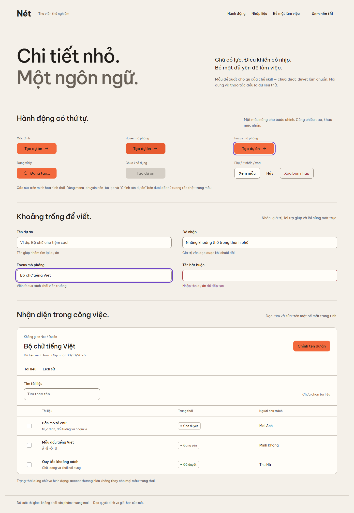
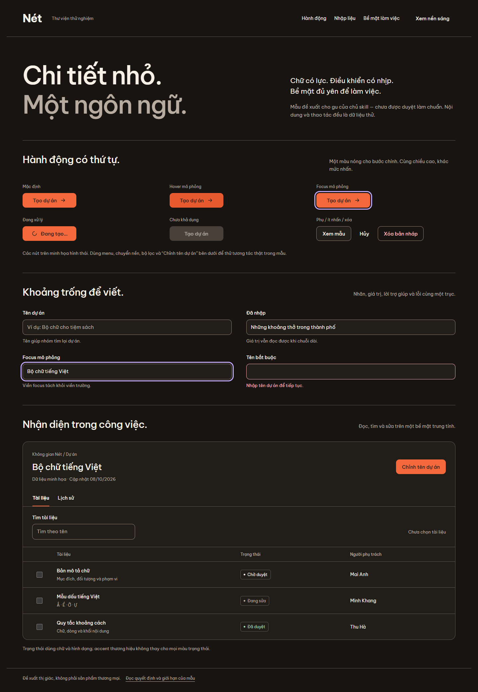
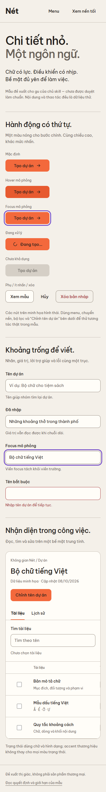
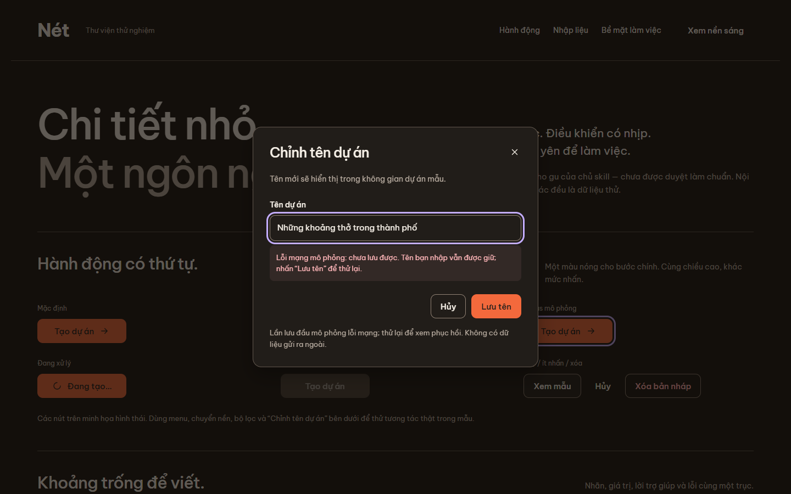

# Component specimen: Nét

This is an **original candidate reference**, not an owner-approved visual standard or a complete design system. It translates the owner's editorial taste into small, usable controls. Its Vietnamese content and mock data describe typography work; no interview case is required.

Open [the interactive specimen](../assets/specimen/index.html) locally in a browser. GitHub displays source HTML, not a running page. [Render and interaction checks](../scripts/render-review.cjs) produce the screenshots and evidence below. Use the specimen to understand relationships; do not insert its values into every project.

## Four views of the same system

| Narrow viewport | Recovery state |
| --- | --- |
|  |  |

## Anatomy and reasons

| Part | Construction in this specimen | Why it is here; adaptation rule |
| --- | --- | --- |
| Header | Wordmark, three descriptive destinations, theme switch; a labeled menu disclosure on narrow screens | Compact navigation leaves the title in charge. Keep the destinations that the real product needs. A brand can need a different shell. |
| Primary button | Dark ink on ember fill, 44 px minimum height, 10 px corner, medium weight | The accent identifies an action while its label stays readable. Change the color and corner when the brand demands it; preserve hierarchy and legibility. |
| Secondary/quiet/danger | Outline, text-only, and explicit destructive wording | The same shape can serve distinct priority levels. Color alone never names a destructive outcome. |
| Focus | Purple outline with separation from the component edge | It remains recognizable on both themes. The static preview illustrates styling; keyboard operation must also be checked in the real browser. |
| Input | Persistent label, example value or hint, visible boundary, error text below | The display typography stays outside task input. Focus and invalid feedback have different meanings. Don't use placeholder text as the only label. |
| Tabs | Selected underline and weight; one selected tab in the Tab sequence; arrows/Home/End change tab and focus | Tabs change a local view of the same object. Use navigation links when changing destinations. |
| Table | Quiet rules, left-aligned text, text status, named checkboxes, explicit selection count | The row carries the information; the surrounding panel need not carry a gradient. At narrow widths this table scrolls within its own region, not the whole document. |
| Dialog | One task, input, cancel, save; a native modal and focus return | Failure keeps the value and offers retry in place. The error is an intentional simulation, visibly labeled. |

### Candidate token set

| Role | Light | Dark |
| --- | --- | --- |
| Canvas | `#f4f0e9` | `#171411` |
| Surface | `#fffdf8` | `#211d19` |
| Text | `#211e1b` | `#f6f0e7` |
| Secondary text | `#696158` | `#b8aca0` |
| Quiet divider | `#c5bdb3` | `#62574e` |
| Input / outline-button boundary | `#91877b` | `#918274` |
| Action / label | `#f3693c` / `#211e1b` | Same pair |
| Focus | `#7047c7` | `#c4adff` |
| Error text | `#a12e32` | `#ffb6b9` |
| Success text | `#226443` | `#a0dcbd` |

Geometry: controls at least 44 px high, control corner 10 px, panel corner 16 px. The checkbox has a larger label hit area. Space is chosen around actual label lengths, rather than deriving every distance from a universal number. Self-hosted Be Vietnam Pro supplies Regular, Medium and Bold; [font provenance and OFL license](../assets/fonts/README.md). It is a specimen font, not a compulsory owner typeface.

Neutral surfaces can be light **or dark**. Select them from the actual brand, working context, content density and contrast. A visual reference does not imply that working screens must become white after login.

## State coverage and limits

The first section contains **static visual previews** of default, hover, focus, busy and disabled buttons. They do not submit a real action. Actual controls lower down exercise theme switching, mobile disclosure, tab keyboard navigation, filtering, row selection, dialog opening, Escape/close, a simulated save failure, retry and focus return.

The renderer checks these behaviors and document overflow at 320, 390 and 1440 px. It also records loaded fonts, resource/console failures, reduced motion, computed text contrast and a 200% text enlargement check. See the machine-readable [specimen check results](../assets/specimen/checks.json). These are targeted browser checks, not a WCAG certification, assistive-technology test, persistence test or production backend proof.

To adopt this specimen in a real project:

1. Keep existing brand and proven components first. Select only the useful relationships here.
2. Replace mock objects and labels with actual data and outcomes. Don't advertise simulated saves as real persistence.
3. Define hover, focus, selected, invalid, disabled and pending states for the actual controls; a screenshot of a state is not implementation evidence.
4. Test real long labels, translated copy, permissions, network latency, errors and recovery in the target application.
5. Obtain the owner's visual acceptance before treating these screenshots as a standard.
