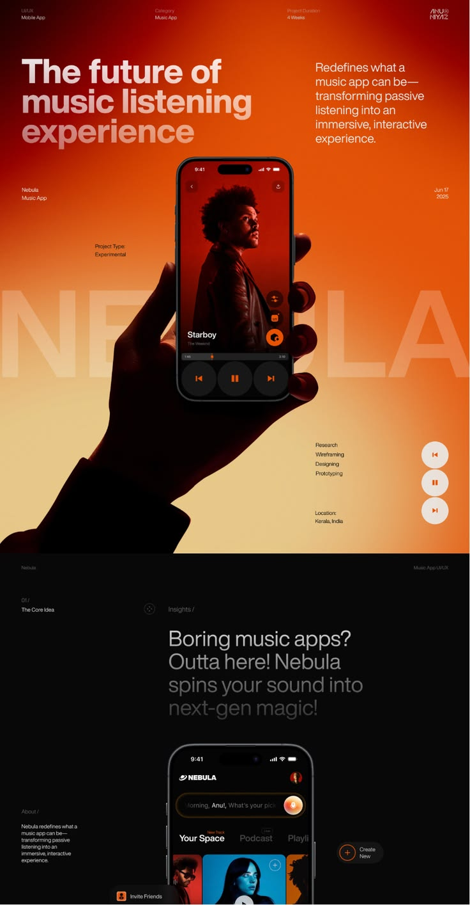
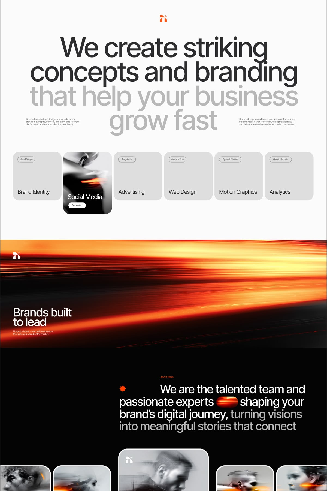
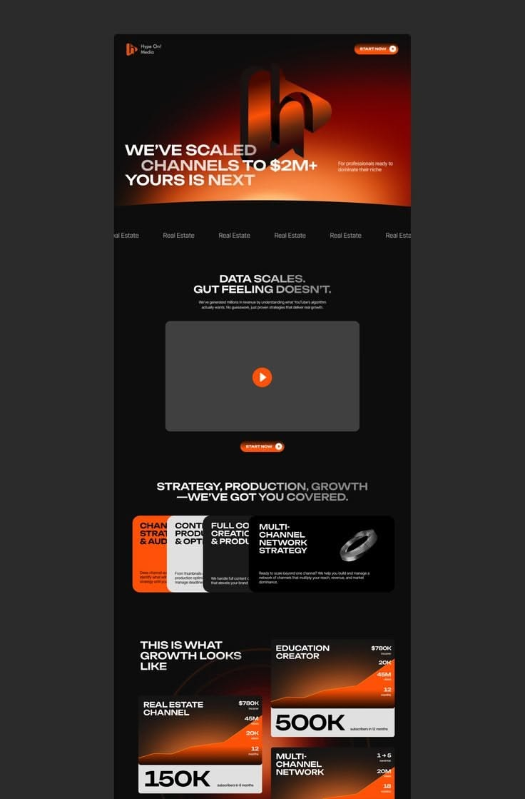
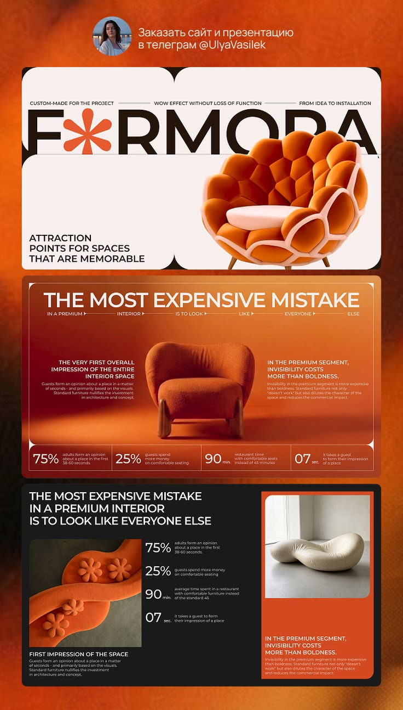
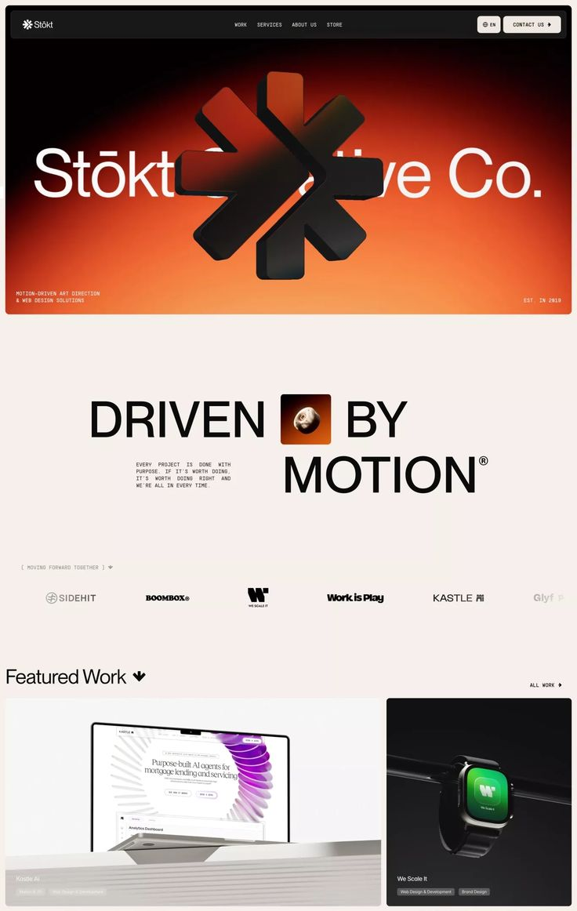
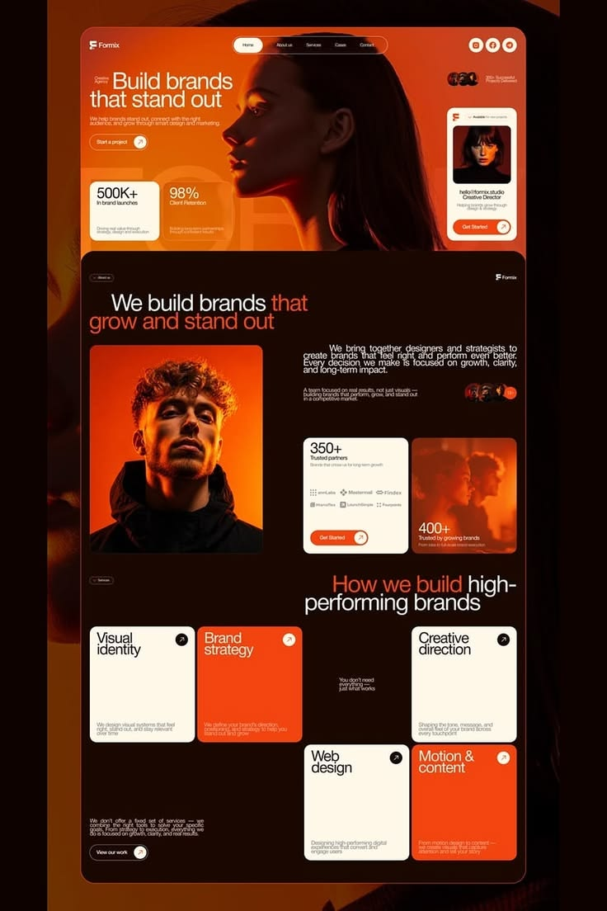
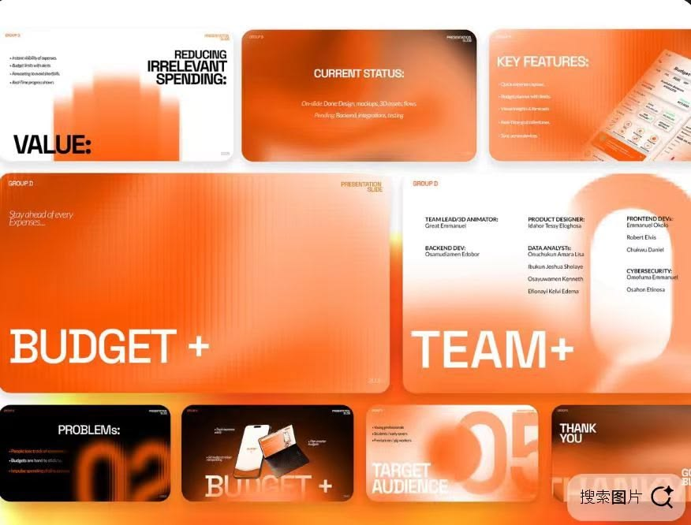

# Seven owner-selected images: a visual study

These are the owner's actual selected reference files, shown below without alteration. The analysis concerns visible composition, not the quality or behavior of any live site. Source, author, performance, accessibility, responsive behavior, and the truth of claims inside the pictures are not established by a screenshot. See the [asset rights note](../assets/owner-references/README.md).

The aim is to extract **mechanisms**: where the eye goes, how a section changes pace, how a small control belongs to the visual language, and what should happen when a user starts working. Do not copy a person, mark, composition, product UI, headline, metric, or exact decorative shape.

For visible numbered regions and small relationships, use the [three annotated detail maps](reference-details.md). For original proposed controls with live states, use the [component specimen](component-specimen.md). Neither is an owner-approved output standard.

## How to read this set

1. Pick the reference whose *mechanism* fits the product object and task; do not average all seven into an orange template.
2. Record the actual placement of two or three devices to try: for example, “subject in the opening, quiet white explanation next, a small hot accent only at the leading action.”
3. For an authenticated product, preserve the identity in type, one accent, crops, and component detail. Give tables, forms, search, and error recovery calm surfaces.
4. Render wide and narrow screens and review real text sizes. Many captions in these images are presentation-scale microtext; they are **not** usable type tokens.

## 01 — A product in a real use moment

**What is visible.** A near-black to hot-orange field makes the phone and hand a single dominant object. The white headline occupies the upper left, while a shorter explanatory block holds the upper right; tiny project metadata sits outside that main conversation. The device covers large translucent background lettering. Its controls and warm screen light connect the campaign scene to the product itself. At the fold, the page turns almost black and the phone becomes a closer interface study.

**Why it works.** The image answers “what does someone hold or do?” before asking the viewer to inspect feature cards. The chapter break changes the job of the page: atmosphere first, product explanation next. The secondary circular controls echo the player, so the detail belongs to the subject.

**Transfer with intent.** For software, show an authentic work artifact or a plausible use moment with enough interface detail to identify the task. Keep any device frame subordinate to that task. Repeat one interaction motif only where its meaning remains clear. In a workspace, a restrained accent on a current item or meaningful action can recall the opening without putting photography behind routine data.

**Rebuild.** The portrait, music-player UI, copy, giant ghost word, and playback buttons belong to this concept. Check contrast over each crop; the faint text and minute annotations are unsuitable defaults. A static play icon is not evidence of playback behavior.

## 02 — Typography leads; light changes the chapter

**What is visible.** The first scene is almost white. Very large black words descend into pale gray continuation; small copy blocks sit near the lower edges instead of filling the headline area. A service row is mostly neutral, with one photographic card creating a local accent. A full-width orange light streak then cuts across the page. The following black chapter returns to large white type and cropped portraits.

**Why it works.** The eye encounters a clear hierarchy: statement, service choices, energetic interruption, deeper story. The hot color has a role because it arrives after a quiet beginning. Card repetition is interrupted once, so the row has a focal point without every tile competing.

**Transfer with intent.** Use a type-first opening when a product's promise needs words before imagery. Reserve a photographic or luminous event for a transition with a real content purpose, such as moving from promise to evidence. A short row of choices can be useful if its selected or featured item is meaningful, not arbitrary.

**Rebuild.** Do not inherit the near-invisible gray text or tiny explanatory captions. The gray cards in the picture do not prove hover, focus, or keyboard behavior. A service card that looks selectable must have a real destination and a clear label.

## 03 — One accent connects chapters, offers, and evidence

**What is visible.** A concentrated orange glow sits behind a large three-dimensional letterform. Below it, dark chapters carry compact headlines, a video-shaped area, a bright CTA, interlocking service panels, and growth-shaped graphics. Orange reappears in actions and data imagery rather than coating every surface. The screenshot is a narrow presentation composite, not evidence of an actual responsive page.

**Why it works.** The accent behaves like a thread across different content forms. The dark field lets a bright graphic or action take turns as the focal point. Staggered modules create a stronger sequence than a uniform service grid.

**Transfer with intent.** Define an accent role before placing it: primary action, active state, image light, or chart emphasis. In a dense product screen, keep the same accent but use it sparingly around the current task. If a chart appears, its axes, units, range, and source matter more than its visual glow.

**Rebuild.** The growth numbers and graphs cannot be imported as proof. A play symbol on a gray box reads as unfinished unless a real video exists. Small dark text and repeated labels should be replaced with accurate content and readable hierarchy.

## 04 — The product's material shapes the UI language

**What is visible.** A sculptural chair overlaps enormous black lettering on a warm, segmented stage. Inward-rounded corners and thin dividers recur in the panels. A following orange room scene frames another chair, a large warning statement, two small explanatory columns, and a statistics rail. A darker panel below pairs close object photography with a text block.

**Why it works.** The object supplies both the emotional focal point and a source for form, color, and framing. The later close-up keeps the subject present while changing scale. The recurring panel geometry makes the sections related.

**Transfer with intent.** Start with the real material or object: its silhouette, joinery, finish, or production process may suggest a subtle edge treatment or divider system. Use one custom detail consistently rather than applying it to every rectangle. In product UI, the detail may belong on a featured object card while filters and forms stay conventional.

**Rebuild.** The exact chair, inward corner silhouette, brand lettering, and statistics belong to this image. The visible numerical claims and percentages need sources. Dense poster copy should not become the default text size for a website.

## 05 — Maximum presence followed by breathing room

**What is visible.** A compact black navigation bar frames a hot, nearly full-bleed hero. A dark dimensional symbol dominates the center and partially masks enormous white lettering. After that, a long cream interval uses a single oversized “driven by motion” composition, a small inserted visual, sparse supporting copy, and then a row of client marks. Featured work appears later in larger image panels.

**Why it works.** The hero spends visual energy once; the pale chapter lets the eye reset. The central mark has weight because the rest of the page gives it space. The featured projects supply specific proof after the brand statement.

**Transfer with intent.** Make one product-relevant object or result memorable in the opening, then change to a calm explanation and concrete examples. Keep navigation compact so it does not compete with the scene. If type overlaps a subject, preserve the meaningful words at every viewport.

**Rebuild.** The mark, its geometry, and its exact overlap are someone else's identity. Client logos are not decorative fillers. On small screens, preserve title readability before preserving the dramatic overlap.

## 06 — Human presence with a strict component rhythm

**What is visible.** Warm side-lit portraits occupy the hero and a later content panel. A rounded frame contains a compact header and a series of unequal blocks. Cream and orange cards alternate against a near-black surface, with small circular arrow actions. The portrait is not an isolated stock flourish: it repeats the lighting and color logic of the cards.

**Why it works.** A human subject gives the studio story presence, while a strict warm palette and repeated control geometry tie varied modules together. Asymmetry creates energy without turning every panel into a different visual language.

**Transfer with intent.** Use a person when their role in the product story is known: maker, practitioner, customer with permission, or the person doing the task. Carry the same light direction and surface colors into the supporting system. Vary card spans by actual importance and content length.

**Rebuild.** Do not import faces, social proof, client counts, or retention figures. The tiny body copy is too small to validate from this composite. In an authenticated workspace, portraits may be appropriate for identity or collaboration, while repeated operational panels should remain quiet and easy to scan.

## 07 — A graphic system is not a web flow

**What is visible.** Separate slides repeat a saturated orange gradient, broad interior margins, sparse upper annotations, large bottom-aligned labels, and a plus sign as punctuation. Light and dark cards alternate. Some panels include device art, while others rely almost entirely on type and color.

**Why it works.** Repetition of a few strong choices lets many distinct layouts feel like one deck. The recurring sign and gradient make the sequence recognizable even when the information density changes.

**Transfer with intent.** A website can borrow the idea of a repeated visual cue across chapters or screens, while the underlying content structure remains task-based. Use a symbol only if it has a consistent meaning, such as add, expand, or an established brand mark. For a work app, use its semantic meaning before its decorative value.

**Rebuild.** Slides are fixed-size presentations. They offer no evidence about navigation, reflow, controls, or interaction. Their microtext and oversized lower labels should not be pasted into a responsive UI. The visible device panel is illustrative, not proof of a functioning feature.

## Synthesis: choosing, composing, and checking

| If the product needs… | Look first at… | Candidate move | Inspect before acceptance |
| --- | --- | --- | --- |
| A recognizable use moment | 01 | Put the real task or object in a scene, then move to a quieter product explanation. | Can the task still be recognized without the mood lighting? |
| A clear statement before imagery | 02 | Lead with type; place one visual interruption after the first explanation. | Is all display and supporting text readable on mobile? |
| One accent across unlike content | 03 or 07 | Give the accent a small set of roles, including a real active/primary state. | Do status colors and graph meanings remain distinct? |
| Physical material as design source | 04 | Derive one repeated shape or divider from the object. | Is the shape still useful when the object image is absent? |
| A strong opening with calmer follow-through | 05 | Spend visual energy in one scene, then create space for proof. | Does the next section actually explain or prove something? |
| People and varied modules | 06 | Use a relevant person and vary panel spans by importance. | Are identity, consent, claims, and copy accurate? |

### Component translation from the pictures

- **Header / navigation:** References 01, 05, and 06 keep chrome compact so the subject leads. In a real site, a small header still needs a visible current location, usable target sizes, clear menu behavior, and a keyboard path. In an app, persistent navigation should prioritize orientation over theatrical framing.
- **Primary button:** Hot color is effective because it is scarce in references 03 and 06. Use it for one leading outcome in each context; secondary actions should remain distinguishable. Verify normal, hover, focus, pressed, loading, disabled, and error behavior rather than treating the screenshot as a complete component spec.
- **Cards:** References 02, 03, 04, and 06 vary emphasis. A card's size should follow content priority or a user decision. Avoid arbitrary equal tiles and avoid implying that decorative panels are clickable.
- **Forms and tables:** None of the seven images establishes robust form or table behavior. Derive these from the task model and [component craft](component-craft.md); retain the identity in typography, a limited accent, and fine dividers. Do not use full-bleed orange or microtype behind editable data.
- **Mobile:** The supplied compositions are not responsive proofs. Recompose rather than scaling a poster down: protect the subject crop, move or remove nonessential annotations, reflow the headline, and keep actions within reach.

### What remains unknown

The seven files do not show a complete authenticated system, accessibility states, error recovery, data density, motion behavior, or verified conversions. Use [owner product UI](owner-product-ui.md), [product UI](product-ui.md), and the [evaluation rubric](evaluation.md) for those decisions. A future owner-approved render can become a visual baseline; these references alone are a taste signal, not an implementation template.
