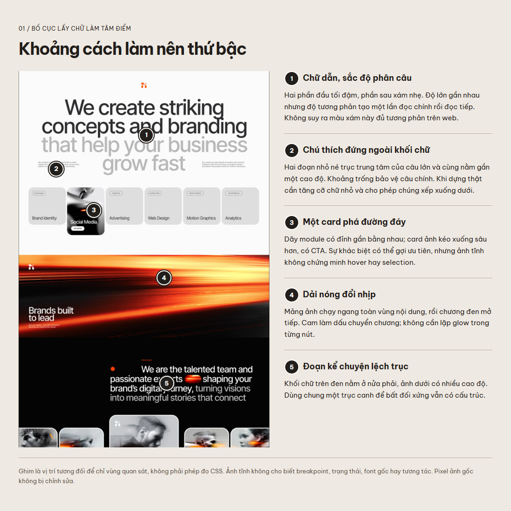
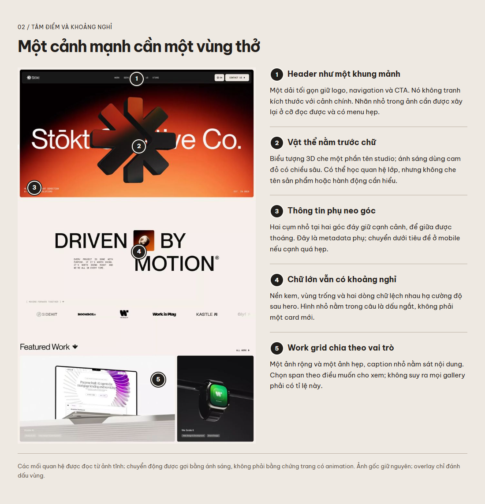
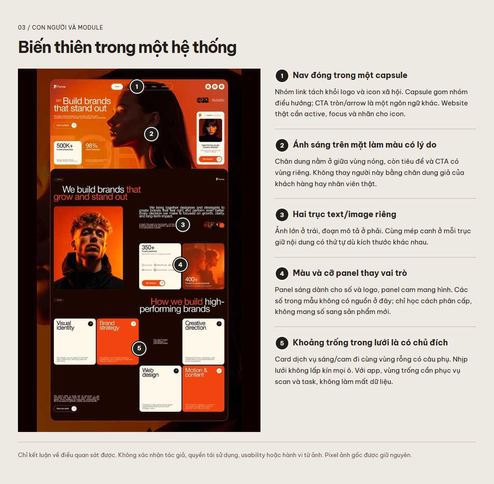

# Reading the small decisions in three originals

These annotated views make the image analysis auditable. Numbered pins identify regions, and the accompanying text describes **observable relationships**. The original JPGs remain unchanged. A pin's percentage position is an annotation coordinate, not a recovered layout token.

## Type, spacing and module priority

The oversized statement changes emphasis through tone, while small supporting text occupies separate axes. The image module breaks the shared card baseline. The orange strip creates a chapter boundary. For implementation, retain these relationships only if they clarify the real offer. Rebuild small copy at readable sizes and test line breaks with Vietnamese content.

## Header, layering and pause

A compact header frames a dominant subject. Metadata anchors the scene edges. The warm-white section changes intensity while retaining confident type. An inline image acts like punctuation. These are transferable devices; the exact logo, 3D asset and layout belong to the reference and are not a production template.

## Navigation, human light and incomplete grids

Navigation is visually grouped, the portrait motivates the warm palette, and content modules vary in role and intensity. Empty grid cells make space for supporting statements. Don't infer hover, click targets or outcomes from a still image. A product workspace should retain the visual character through typography and controls without inheriting sparse information where the task requires density.

## Translating an observation into a usable rule

Write the chain explicitly: **observed relationship → intended effect → context where it helps → implementation constraint → check**.

Example: small header above an immersive scene → keep attention on the product while retaining a route → public studio page → readable link labels and a narrow-screen disclosure → render at 390 px and traverse every destination by keyboard. This is stronger than “use a tiny nav.”

For small controls, use the [original component specimen](component-specimen.md) and [behavior rules](component-craft.md). No source image establishes its button height, font family, focus treatment, responsive breakpoints or accessibility compliance. Do not guess exact CSS from screenshots.

[Diagram source](../assets/reference-maps/index.html) lets you inspect the overlays. Diagrams include reference pixels and inherit the [image-use limitations](../assets/owner-references/README.md); the MIT license does not grant permission to reuse those pixels elsewhere.
